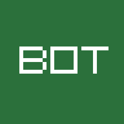
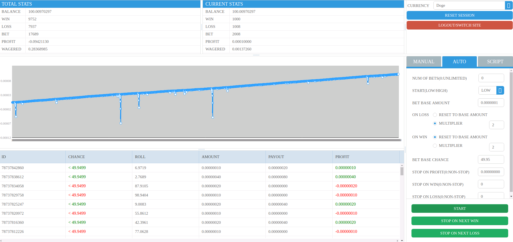
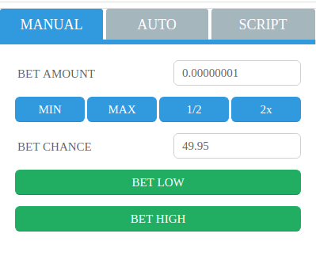
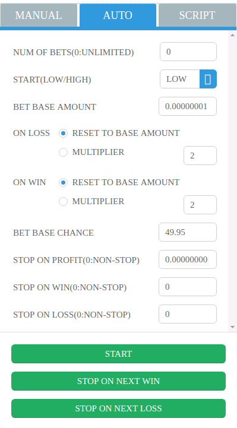

# MyDiceBot
* [https://mydicebot.com](https://mydicebot.com)
* [MyDiceBot](https://mydicebot.com) is World #1 Cross-Platform Dicing Bot.
* Multiple platforms are supported, including __Windows, Mac, Linux,__ and __Web__.
* Multiple blockchains are supported, including __STEEM__.
* Multiple programming languages are supported such as  __Lua__.
* [Open Source](https://github.com/mydicebot/mydicebot.github.io) and __Free Forever__



# Table Of Content
   * [Download](#download)
   * [Supporting Dice Sites (alphabet sequence)](#supporting-dice-sites-alphabet-sequence)
   * [TODO](#todo)
   * [Quick Start](#quick-start)
   * [Startup Options](#startup-options)
   * [Features](#features)
   * [Manual Bet](#manual-bet)
   * [Auto Bet](#auto-bet)
   * [Script Bet](#script-bet)
       * [Internal Variables](#internal-variables)
       * [Internal Functions](#internal-functions)
       * [Sample Code](#sample-code)
       * [Script Gist](#script-gist)
   * [Report Issue](#report-issue)
   * [License](#license)
   * [Thanks](#thanks)
   * [Quote](#quote)
   * [Disclaimer](#disclaimer)
   * [Legal](#legal)
   * [Contact](#contact)
   * [Donation](#donation)

# Online Simulator
* [https://simulator.mydicebot.com](https://simulator.mydicebot.com)

# Download
* Binaries: [https://github.com/mydicebot/mydicebot.github.io/releases](https://github.com/mydicebot/mydicebot.github.io/releases)
* Source Code: [https://github.com/mydicebot/mydicebot.github.io](https://github.com/mydicebot/mydicebot.github.io)

# Supporting Dice Sites (alphabet sequence)
## Traditional
* [999Dice](https://www.999dice.com/?224280708)
* [Bitsler](https://www.bitsler.com/?ref=mydicebot)
* [Crypto-Games](https://www.crypto-games.net?i=CpQP3V8Up2)
* [PrimeDice](https://primedice.com/?c=mydicebot)
* [Stake](https://stake.com/?code=mydicebot)
* [YoloDice](https://yolodice.com/r?6fAf-wVz)
## Blockchain - STEEM
* [EpicDice](https://epicdice.io/?ref=mydicebot)
* [SteemBet](https://steem-bet.com?ref=mydicebot)

# TODO
* [BetKing (coming soon)](https://betking.io/?ref=u:mydicebot)
* [BitDice (coming soon)](https://www.bitdice.me/?r=90479)
* [BitVest (coming soon)](https://bitvest.io?r=108792)
* [Dice-Bet (coming soon)](https://dice-bet.com/?ref=u:mydicebot)
* [DuckDice (coming soon)](https://duckdice.com/ab61534783)
* [Freebitco.in (coming soon)](https://freebitco.in/?r=16392656)
* [KingDice (coming soon)](https://kingdice.com/#/welcome?aff=180722)
* [MegaDice (coming soon)](https://www.megadice.com/?a=326492144)
* [NitroDice (coming soon)](https://www.nitrodice.com?ref=0N2pG8rkL7UR6oMzZWEj)
* [NitrogenSports (coming soon)](https://nitrogensports.eu/r/4998127)
* [SafeDice (coming soon)](https://safedice.com/?r=100309)
* (More will be coming soon)

# Quick Start
* Download MyDiceBot Binaries here: [MyDiceBot Releases](https://github.com/mydicebot/mydicebot.github.io/releases).
* Different execution methods on different platforms.
    * Linux (Open Terminal)
  
        ```
        chmod +x mydicebot-linux
        ```

        ```
        ./mydicebot-linux
        ```

    * Mac (Open Terminal)
        
        ```
        chmod +x mydicebot-macos
        ```

        ```
        ./mydicebot-macos
        ```  

    * Windows (Open Command Prompt)
        
        ```
        mydicebot-win.exe
        ```

* Choose Dice Site, Input username/password/2FA/APIKey, then Login.
* Bet and WIN.

# Startup Options
* __-port__ (port is 3000 by default)
  
    ```
    mydicebot-win.exe -port 12345
    ```

# Features
* Supported platforms: __Windows, Mac, Linux, Web__
* Supported programming languages: __Lua__
* Supported multiple dice-sites
* Supported multiple strategies
* New account registration
* Existing account login
* Betting statistics
* Manual bet
* Auto bet
* Script bet (__compatible with Seuntjies DiceBot scripts__)
* Script upload/download/voting (coming soon)
* Github integration (coming soon)

# Manual Bet
* You can control every bet by yourself.



# Auto Bet
* Essential configurations are provided for betting automatically.
 


# Script Bet
* Lua programming language
* JavaScript programming language (coming soon)
* Python programming language (coming soon)
* __Compatible with the variables and functions of Seuntjie DiceBot's Lua script__


## Internal Variables
* __Single Bet Info__

|Variable|Type|Permission|Purpose|
|---|---|---|---|
|__basebet__|double|Read Write|Shows the amount of the first bet. Only set for first bet.|
|__previousbet__|double|Read Only|Shows the amount of the previous bet. Only set after first bet.|
|__nextbet__|double|Read Write|The amount to bet in the next bet. You need to assign a value to this variable to change the amount bet. Defaults to previousbet after first bet. Needs to be set before betting can start.|
|__chance__|double|Read Write|The chance to win when betting. Defaults to value set in advanced settings if not set. Need to set this value to change the chance to win/payout when betting.|
|__bethigh__|bool|Read Write|Whether to bet high/over (true) or low/under(false). Defaults to true (bet high/bet over)|
|__win__|bool|Read Only|Indicates whether the last bet you made was a winning bet (true) or a losing bet (false).|
|__currentprofit__|double|Read Only|Shows the profit for the last bet made. This is not the amount returned. betting 1 unit at x2 payout, when winning, currentprofit will show 0.00000001 (returned =0.00000002), when losing, profit will show -0.00000001|

* __Current Session Info__

|Variable|Type|Permission|Purpose|
|---|---|---|---|
|__balance__|double|Read Only|Lists your balance at the site you're logged in to.|
|__bets__|int|Read Only|Shows the number of bets for the current session.|
|__wins__|int|Read Only|Shows the number of wins for the current session.|
|__losses__|int|Read Only|Shows the number of losses for the current session.|
|__profit__|double|Read Only|Shows your session profit. Session is defined as the time since opening the current instance of bot or the last time you reset your stats in the bot.|
|__currentstreak__|double|Read Only|Shows the current winning or losing streak. When positive (>0), it's a winning streak. When negative (<0) it's a losing streak. Can never be 0. Only set after first bet.|
|__currentroll__|double|Read Only|Show current roll information|

## Internal Functions

|Function|Purpose|
|---|---|
|__dobet()__|The loop of bets|
|__stop()__|Stop the bet|

## Sample Code
* Strategy: Basic Martingale

```lua
chance = 49.5
multiplier = 2
basebet = 0.00000010
bethigh = false

function dobet()
    if profit >= 0.1 then
        stop()
    end
    
    if win then
        nextbet = basebet
    else
        nextbet = previousbet * multiplier
    end
end
```

# Report Issue
* [https://github.com/mydicebot/mydicebot.github.io/issues](https://github.com/mydicebot/mydicebot.github.io/issues)

# License
* GPL-3.0

# Thanks
* Special thanks to the open source project of [Seuntjies DiceBot](https://github.com/Seuntjie900/DiceBot). 
* If you need simulation functions or advanced-autobet functions, we recommand Seuntjies DiceBot.

# Quote
* "Gambling is gambling no matter what you do or how good your strategy is. The house always wins if you keep playing. Winners know when to stop."
* "Like any human, we make mistakes, and like any program, the bot is bound to have a few bugs. Use the bot at your own risk. "

# Disclaimer
* This is still gambling. The bot is not guaranteed to win. 
* Please do not gamble more than you can afford to lose. 
* The bot has a lot of settings, and we cannot test each and every combination. 
* The bot might behave unpredictable and unreliably with certain combinations of settings.
* Certain actions from the server might also result in unexpected behavior. 
* We cannot be held responsible for any losses incurred while using the bot.

# Legal
* It is your obligation to ensure compliance with any legislation relevant to your country of domicile regarding online gambling.

# Contact
* github: [https://github.com/mydicebot/mydicebot.github.io/issues](https://github.com/mydicebot/mydicebot.github.io/issues)
* steemit: [https://steemit.com/@mydicebot](https://steemit.com/@mydicebot)
* bitcointalk: [MyDiceBot - Cross-Platform | Multi-Script-Language | Multi-Site | Multi-Strategy](https://bitcointalk.org/index.php?topic=5057661)
* discord: [https://discord.gg/S6W5ec9](https://discord.gg/S6W5ec9)

# Donation
* BTC: 19Yw3Hs8zAidGEUNeEUM2r4tXLnrJDy7kN
* ETH: 0x3d652737ad9906344C0fb9C693bD3917FDaa37dC
* BCH: qpwukqk0a557yytlg9x9tl77qjh8lje03gyd73qgm6
* DOGE: D9wMjdtGqsDZvjxWMjt66JLjE9E9nMAKb7
* steemit: [@mydicebot](https://steemit.com/@mydicebot)
